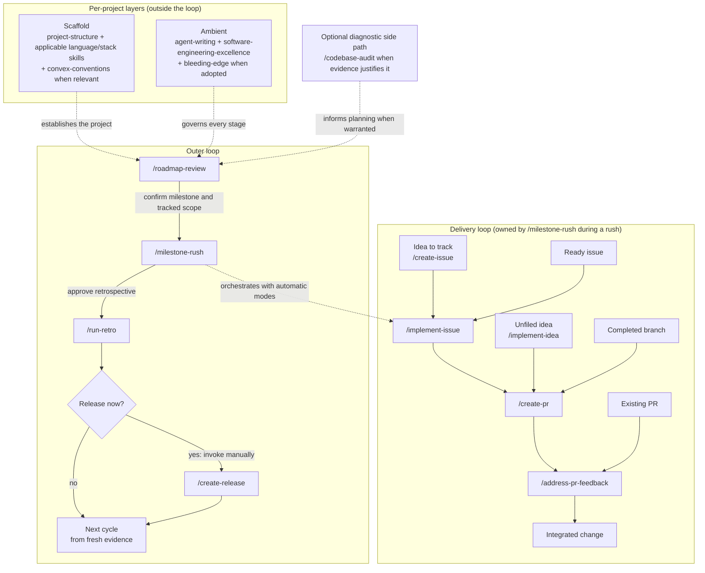

# Known Good Route


My personal collection of agent skills for agentic coding: portable `SKILL.md` files that keep my workflows and conventions consistent across projects, covering day-to-day flows (git, issues, PRs, reviews) and one-off project setup, stack, and audit guidance.

## Install

```bash
npx skills add frostney/known-good-route
```

Installs into your skills-compatible agent(s): Cursor, Claude Code, Codex, GitHub Copilot, and more. See [skills.sh](https://www.skills.sh/) for details.

## Usage

These are [Agent Skills](https://agentskills.io): any skills-compatible agent loads each skill's `name` and `description` at startup and reads the full `SKILL.md` when a task matches. Several are invoked directly as slash commands (e.g. `/create-pr`, `/implement-issue`); the rest activate from ambient context. The skills split into recurring workflow skills and one-off setup, guidance, and audit skills.

### Operating loop

Establish each repository's **Scaffold** once, keep its **Ambient** guidance
active throughout, and run the outer loop from fresh project and forge evidence.
Enter at the state the work is actually in; never replay earlier stages merely
for ceremony.



- **Scaffold** is the repository's structural and stack foundation:
  `project-structure`, the applicable language and stack skills, and
  `convex-conventions` when Convex is in scope. It is not another step in every
  delivery cycle.
- **Ambient** guidance governs every stage: `agent-writing`,
  `software-engineering-excellence`, plus `bleeding-edge` when the project has
  adopted it. When one conversation coordinates two or more substantial
  deliverables outside an active orchestrator, it retains decisions and
  provenance while one context-isolated bounded worker owns each deliverable
  and returns a terminal summary.
- Every outer-loop transition is human-controlled. `/roadmap-review` proposes
  the milestone, `/milestone-rush` offers the retrospective after integrated
  completion, and `/create-release` is an optional manual step after
  `/run-retro`; none starts the next stage automatically.
- While `/milestone-rush` is active, let it own the nested delivery loop. It
  delegates implementation through the automatic modes, PR handoff, continuous
  review-axis-lane code review, and merge instead of asking the user to invoke
  those child commands.
- For ad-hoc or already-started work, enter the delivery loop at the matching
  state: record an idea with `/create-issue`, implement a ready issue or unfiled
  idea, hand off a completed branch with `/create-pr`, or continue an existing
  PR with `/address-pr-feedback`.
- `/codebase-audit` is a diagnostic side path when repository evidence warrants
  a whole-codebase assessment, not a mandatory checkpoint.
- Supporting mechanics stay underneath the loop: `git-workflow` governs git
  operations, `/code-review fix-all` is the ordinary bounded pre-PR review,
  milestone rush uses `/code-review subagents fix-all`, `address-pr-feedback`
  repeats local specification, functional-validation, project-gate, and
  `/code-review fix-all` checks before substantive pushes, and `/update-pr`
  handles the resulting commits and pushes.

### Recurring workflow skills

| Skill | What it does |
| --- | --- |
| [`git-workflow`](git-workflow/SKILL.md) | Default git workflow: automatically update clean local-default work and create new local branches/worktrees from the latest remote default; stop on dirty default state and ask whether to discard it or use a focused branch/worktree; require impact-focused commit and PR titles; use ordinary merge-only branches or guarded native GitHub stacks, always-new commits, and squash merges. |
| [`status-report`](status-report/SKILL.md) | Build a live, read-only Kanban of every open PR and all local worktrees, using current-head CI and review gates, short semantic local-change summaries, and rich, Mermaid, or Markdown rendering according to host capability. |
| [`create-issue`](create-issue/SKILL.md) | File a well-structured GitHub issue from a tagline using the project's issue template and `VISION.md` when present, grill for thoroughness, and add a GitHub Note with the exact user and model attribution. Supports `automatic` mode for project-context template/label/body selection. |
| [`implement-issue`](implement-issue/SKILL.md) | Validate an issue, derive every viable option from one neutral evidence packet, apply one predeclared rubric and equivalent checks, then select, implement, verify, review, and hand off via `/create-pr`. Supports gated `automatic` selection. |
| [`implement-idea`](implement-idea/SKILL.md) | Turn an unfiled idea into a confirmed mini-spec, derive every viable option from one neutral evidence packet, apply one predeclared rubric and equivalent checks, then select, implement, verify, review, and hand off via `/create-pr`. Supports gated `automatic` selection. |
| [`run-retro`](run-retro/SKILL.md) | Review a completed workstream and produce an interactive HTML impact report with per-item summaries of at most 300 characters, evidence-backed Before/After states, copyable or app-linked deep dives, and optional animated mechanism diagrams. |
| [`create-pr`](create-pr/SKILL.md) | Converge the complete change locally against its specification and real behavior before the first push, open a templated draft PR or submit a verified native GitHub stack, fill PR-only readiness gaps, fix CI failures through the same local loop, and mark each ready layer ready. |
| [`update-pr`](update-pr/SKILL.md) | Commit and update the current PR, merging ordinary baselines or using guarded native stack synchronization, then refresh stale metadata. |
| [`address-pr-feedback`](address-pr-feedback/SKILL.md) | Address feedback on one PR, actively validate its specification and delivered behavior before substantive pushes, run `/code-review fix-all`, require exact-final-head CI and review evidence, reply in originating threads, and wait deterministically. Normal mode never merges; `automatic-merge` merges only an ordinary ready PR. |
| [`delivery-wait`](delivery-wait/SKILL.md) | Internal deterministic GitHub transition waits for exact-head checks, workflows, merges, tags, release assets, and time-based wakes. |
| [`code-review`](code-review/SKILL.md) | Review a bounded change against its claim using behavioral and revert-clean falsification probes, churn-backed risk, four-layer de-duplication, calibrated findings through non-blocking Nitpicks, and discoverability checks when public web surfaces change. Additive inputs support evidence lanes, exact files, and prior-finding revalidation; fix modes remain local. |
| [`create-release`](create-release/SKILL.md) | Prepare a changelog-first release PR, then publish only when authorized and through exactly one evidence-backed path. Existing workflows own publication when configured; the agent never double-publishes with `gh release create`. |
| [`roadmap-review`](roadmap-review/SKILL.md) | Review a project's roadmap from freshly-pulled data: assess current state and release cadence, measure delivery velocity from history, verify candidate work against the source, produce a parallelized throughput-anchored version plan, and (optionally, on confirmation) create milestones and issues. |
| [`milestone-rush`](milestone-rush/SKILL.md) | Complete a confirmed milestone through repository-owned preflights, isolated worker packets, focused remediation, one terminal complete gate, event-driven waits, native stacks or ordinary PRs, and a closure-validated timing/token ledger; verify integrated completion and offer an explicitly approved retrospective. |

### One-off project setup, guidance, and audit skills

| Skill | What it does |
| --- | --- |
| [`project-structure`](project-structure/SKILL.md) | Language-agnostic repo layout, `README.md` structure, `docs/` template, `AGENTS.md` template (with `CLAUDE.md` symlink and `.agents/skills` ↔ `.claude/skills`), pre-commit hook contract (Lefthook default), scripts directory, changelog (git-cliff), markdown linting (markdownlint), and contracts for duplication, link checking, and architectural / docs–implementation drift. |
| [`typescript-stack`](typescript-stack/SKILL.md) | Framework-neutral strict TypeScript conventions for runtime-aligned compiler settings, trustworthy boundaries, explicit public APIs, modules, type/runtime tests, and emitted or no-emit validation. |
| [`react-stack`](react-stack/SKILL.md) | Default React-based stack across web (Next.js App Router) and universal (Expo Router) profiles, with a shared core of Bun, Tailwind 4, Biome, Knip, Fallow, `bun test`, Vercel AI Gateway, Clerk, Convex, Plop, Lefthook, Atomic Design, and domain-based `src/`. TypeScript policy belongs to `typescript-stack`. |
| [`native-nostalgia-stack`](native-nostalgia-stack/SKILL.md) | FreePascal toolchain: FPC in Delphi mode (compiler flags in a shared include), namespace-based unit naming (flat by default), code-style starting points, build / formatter / codebase-health contracts (implementation is the project's choice), Lefthook pre-commit, InstantFPC for one-off scripts. |
| [`convex-conventions`](convex-conventions/SKILL.md) | Convex backend rules: shared validators, Clerk JWT bridge, `args` + `returns` on every public function, in-code filtering, `.take()` caps, rate-limited mutations, action/mutation split, schema with soft-delete and audit trails, single re-export module for client types. The live Convex docs override this skill on conflict. |
| [`codebase-audit`](codebase-audit/SKILL.md) | Audit the repository and delivery surface with a coverage map, conditional technical and discoverability perspectives, revert-clean falsification probes, four-layer de-duplication, and churn-backed architectural risk. Evidence can use bounded lanes; remediation requires a selected coherent batch. |
| [`software-engineering-excellence`](software-engineering-excellence/SKILL.md) | Ambient engineering-quality standard for planning, orchestration, development, debugging, review, refactoring, and substantial investigation: ground in reality, solve the full scope, reuse before creating, validate the real behavior, protect product and developer-feedback performance throughout delivery, and keep maintainability as the governor. |
| [`agent-writing`](agent-writing/SKILL.md) | Ambient project-prose guidance: project rules first, outcome and evidence before background, plain active language, numerical revision thresholds rather than length targets, a conditional durable-prose revision catalogue, deterministic prohibited wording, and hard 300-character limits for review replies and retrospective impact items. |
| [`bleeding-edge`](bleeding-edge/SKILL.md) | Ambient lens favoring the newest viable option, including just-released stable versions and justified pre-release channels, under `software-engineering-excellence`: verify live, pin, keep choices reversible and gate-green, and never silently replace a decided choice. |

## Background

Design decisions and conventions shared across every skill in this collection.

The suite is also audited against
[Writing Great Skills](https://github.com/mattpocock/skills/tree/main/skills/productivity/writing-great-skills):
keep the process predictable, completion criteria checkable, each rule in one
authoritative place, branch-specific detail behind direct context pointers, and
no-op prose pruned.

### Frontier-model prompt contract

The skills target current frontier models without relying on one model's default
behavior. The current baseline is the official guidance for
[GPT-5.6 / Sol](https://developers.openai.com/api/docs/guides/latest-model#prompting-best-practices),
[Claude Fable 5](https://platform.claude.com/docs/en/build-with-claude/prompt-engineering/prompting-claude-fable-5),
and
[Claude Opus 5](https://platform.claude.com/docs/en/build-with-claude/prompt-engineering/prompting-claude-opus-5),
including Anthropic's
[Claude 5 context-engineering rules](https://claude.com/blog/the-new-rules-of-context-engineering-for-claude-5-generation-models).

- Lead with the owned outcome, why it matters, completion evidence, boundaries,
  and stop rules. Prescribe exact mechanics only when the route is load-bearing.
- State each runtime rule once. Use `must`, `never`, and `only` for genuine
  invariants; use decision rules for investigation depth, optional tools,
  proportional validation, and when user input is truly required.
- Preserve task-specific checks that define completion. Do not add generic
  self-check, double-check, or verifier passes around them.
- Delegate only genuinely independent, sizeable work with a bounded fan-out.
  Do not use subagents merely to duplicate work or re-check a small task.
- For autonomous orchestration, repository-owned capability classes, context
  envelopes, token checkpoints, and escalation policy belong in
  `ORCHESTRATION.md`. Provider-specific model selection and harness plumbing stay
  in the host; reusable skills express only capability and observable behavior.
- Ground progress and completion claims in current tool or source evidence.
  Report sparse outcomes at material phase changes; finish authorized reversible
  work instead of ending on a promise or a redundant permission question.
- Lead final responses and written artifacts with the outcome. Keep complete,
  readable sentences and decision-relevant evidence; omit filler, boilerplate,
  repeated summaries, and internal-reasoning narration.
- Keep startup descriptions limited to outcome and activation criteria. Put
  model effort, verbosity, thinking, context-budget plumbing, asynchronous
  progress delivery, and any model-specific verifier strategy in the harness.
- Keep ambient repository context lightweight and specific: non-obvious
  decisions, gotchas, commands, and boundaries rather than facts visible in the
  tree. Prefer expressive tool and file interfaces plus rich references over
  generic worked examples that narrow exploration.
- Validate prompt changes incrementally on the same representative scenarios.

Fable 5 benefits from explicit evidence grounding on long autonomous runs,
while Opus 5 can over-verify when given generic verification or
verifier-subagent instructions. Skills therefore name the observable evidence
and project gates that matter; model-specific scaffolding decides how to obtain
that evidence.

### Conventions across all skills

- Each skill has a concise `SKILL.md` with conforming frontmatter (`name`,
  third-person `description` ending with "Use when…", `license`, and
  `compatibility` only for real environment requirements). Situational detail
  belongs in directly linked, one-level `references/`; the entry skill says
  exactly when to read each file. No `disable-model-invocation`.
- **Workflow skills** state the outcome, true gates, authorization boundaries,
  and stop rules before exact mechanics. Preserve procedural detail only where
  sequencing is load-bearing.
- **Convention skills** keep durable decisions and audit-checkable completion
  evidence in the entry skill; templates, profiles, and implementation contracts
  load only when relevant.
- **Verify versions live** is a recurring rule across stack skills: the agent confirms the current stable version of every dependency from the registry (`bun pm view <package> version`) or official release notes before adding or upgrading any dependency. Memory and prior conversation turns are not acceptable sources.
- **Live docs override the skill on conflict** for any third-party surface that evolves quickly (Convex, AI Gateway, etc.).
- **No project names** appear in any skill body: patterns are extracted, named projects aren't.
- **Examples** are exceptional. Prefer expressive interfaces and high-fidelity
  references such as code, tests, specs, and artifacts; use a prose example only
  when it resolves an otherwise ambiguous decision.
- **Standalone duplication stays minimal.** The grill gate is duplicated in
  `create-issue`, `implement-issue`, and `implement-idea` because a skill cannot
  depend on another skill's internal reference file. Update all three copies
  together, but do not duplicate rationale or negative examples.

### Cross-skill references

- `implement-issue` and `implement-idea` invoke `/create-pr` at handoff.
- `implement-issue` and `implement-idea` apply `git-workflow`'s clean-worktree
  and freshly fetched remote-default synchronization gate after selecting a
  branch/worktree and before editing.
- `implement-issue` and `implement-idea` invoke one bounded
  `/code-review fix-all` before `/create-pr`; they stop for material new
  decisions and do not proceed with unresolved Blocking or Important findings.
- `code-review` and `codebase-audit` delegate only when the caller supplies the
  additive `subagents` input. Workers own bounded evidence lanes; the
  coordinator owns findings, verdicts, edits, and reported fallbacks.
- `address-pr-feedback` establishes the PR specification, actively exercises
  every criterion whose evidence was invalidated, runs the project gate and
  `/code-review fix-all` on the same unchanged change before each substantive
  code push, then invokes `/update-pr`. It owns review inspection, deterministic
  waiting, replies, and thread resolution through its bundled helper. Read-only
  mode remains non-mutating.
- `create-pr` compares the complete local change with its source specification,
  exercises delivered functionality through its real interface, and fixes gaps
  in a local loop before the first push. PR-only metadata and CI form a second
  readiness phase; code or behavior gaps return to the local loop before the
  next push.
- `address-pr-feedback automatic-merge` discovers active review automation,
  treats incomplete verdicts as pending, and owns one ordinary PR's exact-head
  fix-watch-squash-merge loop. Stack scheduling and atomic merge stay outside
  it.
- `status-report` reuses the current-head CI and reviewer-readiness semantics of
  `address-pr-feedback` and `milestone-rush`, but remains strictly read-only and
  never invokes either workflow.
- `create-release` invokes `/create-pr` to open the release PR, follows
  `git-workflow` for branching and push rules, and defers to `project-structure`
  for changelog tooling. Its publication gate re-reads merged workflows and
  chooses exactly one tag/release publisher before acting.
- `roadmap-review` defers to `software-engineering-excellence` for the general engineering bar, to `project-structure` for `VISION.md` / docs and milestone conventions, recommends (but never performs) release cuts via `/create-release`, and delegates issue creation in the Execute phase to `/create-issue`.
- `roadmap-review` offers `/milestone-rush` only after the user confirms the
  milestone and tracked scope; it never starts the execution engine
  automatically.
- `milestone-rush` parallelizes independent nodes through `/implement-issue
  automatic` or confirmed `/implement-idea automatic`, then uses `/address-pr-feedback
  automatic-merge` for rolling integration. Each implementation's bounded
  pre-PR pass uses `/code-review subagents fix-all` by default, while ordinary
  standalone implementations remain unchanged. It never creates a release and
  invokes `/run-retro` only after explicit approval.
- `run-retro` consumes Milestone Rush's ignored JSONL event ledger when present,
  reconciles it with forge and repository evidence, and keeps exclusive elapsed
  bottlenecks separate from overlapping and aggregate resource consumption. It
  always produces a local HTML impact report with concise Before/After cards
  and offers card-level deep dives through `grilling`.
- `create-issue`, `implement-issue`, and `implement-idea` invoke `/grill-with-docs` (preferred) or `/grill-me` for thoroughness when registered.
- `implement-issue` and `implement-idea` derive all viable options from one
  neutral evidence packet, declare the rubric first, and run equivalent
  decision-relevant checks before recommending. Failed web research stops before
  implementation options.
- `create-issue`, `implement-issue`, and `implement-idea` read `VISION.md` when present and stop for clarification when the request conflicts with it.
- `create-issue`, `implement-issue`, and `implement-idea` support an explicit `automatic` prompt mode where the agent auto-selects the project-context recommendation after completing the required investigation/gates.
- `implement-idea` borrows `/create-issue`'s good-issue components when formulating the idea.
- `run-retro` requires `grilling` for the retrospective interview and final
  confirmation, then applies only user-selected documentation edits and ticket
  actions.
- `typescript-stack`, `react-stack`, and `native-nostalgia-stack` defer to
  `project-structure` for language-neutral repository policy. `react-stack`
  delegates TypeScript language policy to `typescript-stack` and Convex
  specifics to `convex-conventions`.
- `agent-writing` applies to every user-facing item and generated prose artifact.
  Project-specific instructions and templates take precedence. Issues may
  contain many concise items; each review reply and retro impact item is capped
  at 300 characters.
- `bleeding-edge` sits beneath `software-engineering-excellence` as a subordinate lens: it tilts the default technology choice toward the newest viable option while SEE remains the governor and maintainability stays the tiebreaker. It reuses the cross-skill "verify versions live" rule, and it applies its bias *within* the choices decided by the stack skills and `AGENTS.md` Hard Constraints rather than silently swapping them.

## Contributing

Edit or add a `SKILL.md`, then validate it locally before opening a PR:

```bash
pip install --upgrade skills-ref
agentskills validate ./<skill>
```

Every skill is validated against the [Agent Skills specification](https://agentskills.io/specification) in CI via [`skills-ref`](https://github.com/agentskills/agentskills): see [`.github/workflows/validate-skills.yml`](.github/workflows/validate-skills.yml).

For behavioral changes, also run the same representative scenarios against the
supported frontier models:

| Scenario | Expected invariant |
| --- | --- |
| Clear implementation with one selected option | Completes without another permission prompt or unrelated cleanup |
| Materially ambiguous architecture | Surfaces the decision and recommendation before editing |
| Already-fixed issue | Reports source/test evidence instead of inventing a change |
| Branch with committed work and a clean tree | Verifies the local change against its specification and real behavior, then opens the PR without creating an empty commit |
| Dirty focused branch with unrelated local state | Refines and tests only relevant work before the first push, excludes secrets, and marks the PR ready only after all gates pass |
| Local change misses a specification criterion | Exercises the delivered interface, fixes the gap, and repeats local specification and functional checks before opening the draft PR |
| Draft PR missing a Definition of Ready item | Returns repository gaps to local convergence before a new commit and push, then waits for green CI before marking ready |
| Draft PR missing only required metadata | Corrects the PR body or links without creating an empty commit |
| Definition of Ready requires a material decision | Keeps the PR draft and reports the exact unresolved decision |
| Fixable, pending, or external CI failure | Fixes validated in-scope failures, but keeps pending or externally blocked PRs draft |
| PR update with additive merge conflicts | Preserves both feature paths, validates the merge, and pushes normally |
| Explicitly read-only PR review | Reports validated findings without editing or changing PR state |
| Mixed actionable and invalid inline findings | Fixes validated findings, rebuts invalid ones inline, and never posts a top-level comment |
| Review fixes ready to push | Re-establishes the PR specification, actively tests every criterion with invalidated evidence through the delivered interface, passes the project gate and `/code-review fix-all` on the unchanged change, then commits and pushes |
| Issue draft awaiting approval | Investigates, grills, and presents the project-aligned draft without filing it |
| Automatic issue creation and exact duplicate | Completes every investigation/grill gate before filing, but stops immediately for the existing issue |
| Artifact-assisted implementation grill | Derives all viable options from one evidence packet and compares them with a predeclared rubric plus equivalent decision-relevant checks before selection |
| Existing-contract implementation grill | Inspects the embedded behavioral contract and runs an executable compatibility probe before architecture or option selection |
| Required current web research unavailable | Stops before presenting implementation options or editing |
| Default code review and repository-wide audit | Reproduces safe boundary behavior and reports evidence without remediating in read-only mode |
| File-scoped code review | Reports findings only in the exact requested files while disclosing any supporting context needed to validate them |
| Prior-findings revalidation | Rechecks selected review or audit findings against current committed and dirty state without silently performing a fresh review |
| Churn-backed review with JSON output | Measures symbol/file history, requires a concrete architectural co-signal, and writes only the requested machine-readable findings artifact |
| Audit probe requires production mutation | Marks the path static-only and unreached instead of creating an external side effect |
| Measured prototype misses its required target | Stops before production migration, publication, or speculative follow-on work |
| Slow command, hook, local environment, or CI path | Measures the critical feedback path and improves it under the maintainability governor instead of postponing speed until handoff |
| Stale audit with missing evidence | Separates confirmed gaps, corrected claims, and unsupported measurements before planning |
| Rate-limited review bot | Reports the review as unavailable or incomplete, never passed |
| Automatic merge with active review tooling | Retriggers incomplete reviews, evaluates inline and summary findings, and merges only the fully reviewed current head |
| Automatic idea with a provisional mini-spec | Researches, adds the appropriate artifact, confirms the final mini-spec, implements, validates, reviews, and completes the PR handoff |
| Tag-triggered release workflow | Pushes the tag once, monitors automation, and never calls `gh release create` |
| No releasable commits or ambiguous publisher | Stops without manufacturing a version change, tag, or release |
| New branch, Git sync, dirty worktree, and divergent push | Starts focused work at the fetched remote-default tip without tracking it, merges updates without rebasing, stops before syncing dirty work, and never forces a rejected push |
| Sparse or mutation-ready roadmap review | Lowers confidence when evidence is thin and asks before document or forge changes |
| Parallel milestone rush with mixed existing state | Reuses delivered, PR, branch, worktree, and issue state; rolls independent merges forward; and closes only after integrated validation |
| Explicit sub-agent review or audit | Maps bounded evidence lanes, keeps verdicts and edits with the coordinator, and reports any single-agent fallback |
| Milestone rush with a blocked dependency chain | Completes independent work, records replacement and deferred scope, and leaves the blocked milestone open |
| Project structure and stack conventions | Repairs real drift while preserving valid ecosystem layouts and recorded toolchain pins |
| React profile mismatch | Uses the applicable web profile, but does not force web or universal defaults onto an Electron-only project |
| Convex function boundaries | Enforces public validation/auth/rate limits and keeps external I/O in actions with persistence in internal mutations |
| Stable dependency and competing tool choice | Selects the live-verified newest stable version but preserves an authoritative recorded tool decision |
| Retrospective with no durable lesson | Completes all three lenses and reports no action instead of inventing documentation or tickets |
| Long autonomous run | Grounds every progress/completion claim in current evidence and does not end on a promise |
| Chained substantial deliverables | Keeps decisions and provenance in a thin coordinator, delegates one context-isolated bounded worker per deliverable, and consumes terminal summaries instead of raw work traces |
| Small local change | Runs the real project gate without generic re-checks or verifier subagents |
| Local convention differs from a generic default | Follows the surrounding code and project gate instead of imposing a blanket style rule |
| Pascal identifier contains a standard initialism | Preserves forms such as `HTTP` and `GC` unless an external API or project rule requires another spelling |
| Written issue, PR, roadmap, or retrospective | Leads with the outcome and omits filler, boilerplate, and repeated summaries |
| Agent-authored response or artifact | Applies project-specific voice first, states concrete evidence in plain language, removes generated-writing patterns, and preserves quoted source and code exactly |

The provider-neutral [behavioral eval harness](evals/README.md) runs these
scenarios through Vercel AI SDK and AI Gateway. `bun run check` validates the
harness without model spend; `bun run eval` runs the paid model matrix when
`AI_GATEWAY_API_KEY` is present. Paid evals are local-only and require an
explicit command; labels and GitHub Actions never trigger them.

**Validator freshness policy:** `skills-ref` is intentionally installed unpinned (`pip install --upgrade skills-ref`) so CI always validates against the latest published spec implementation rather than a frozen snapshot. The workflow caches `~/.cache/pip` to speed up installs; this is safe because pip still resolves the newest release from the index on every run and only reuses a cached wheel when that exact version was already downloaded, so caching never holds back the validator version. This "always latest" rule applies only to the validator package itself: the workflow's GitHub Actions (`checkout`, `setup-python`, `cache`) are pinned to full commit SHAs (with the version in a trailing comment) for supply-chain safety, which is the recommended hardening practice for third-party actions.

## License

Dual-licensed under either of [The Unlicense](LICENSE) (public domain) or the [MIT License](LICENSE-MIT) at your option. The SPDX expression is `Unlicense OR MIT`; each skill declares it in frontmatter.
