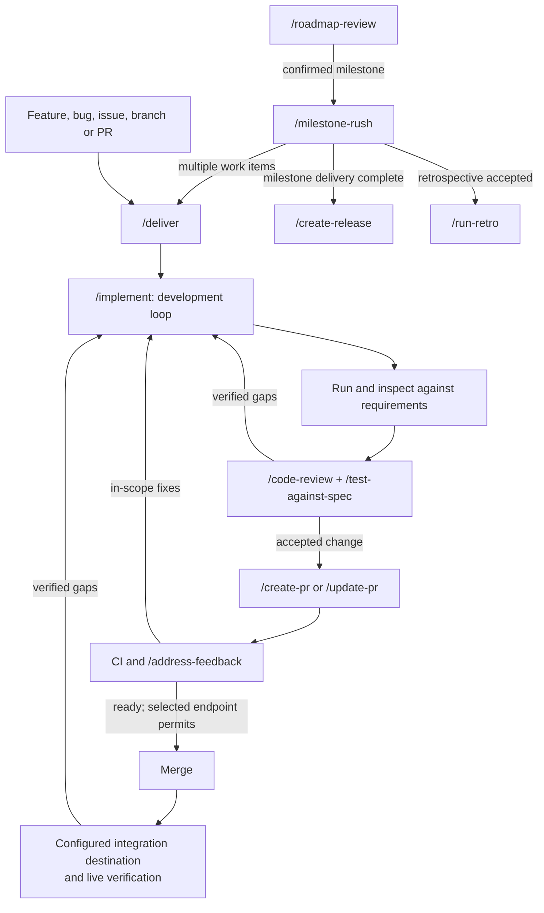

# Known Good Route


My personal collection of portable agent skills for carrying an agreed task to
a verified result across projects, with less steering, avoidable waiting and
rework. The core is the implementation, review and PR delivery loop; planning,
setup and stack guidance support it when relevant.

Skills encode workflow decisions, completion criteria and authorization.
Repositories own product requirements and project commands; tested helpers and
the host harness own execution mechanics. We validate changes against bounded
cases drawn from real work; see [the acceptance strategy](evals/ACCEPTANCE.md).

## Install

```bash
npx skills add frostney/known-good-route
```

Installs into your skills-compatible agent(s): Cursor, Claude Code, Codex, GitHub Copilot, and more. See [skills.sh](https://www.skills.sh/) for details.

## Usage

These are [Agent Skills](https://agentskills.io): any skills-compatible agent loads each skill's `name` and `description` at startup and reads the full `SKILL.md` when a task matches. Several are invoked directly as slash commands (e.g. `/deliver`, `/implement`, `/create-pr`); the rest activate from ambient context. The skills split into recurring workflow skills and one-off setup, guidance, and audit skills.

### Operating loop

Use `/deliver` for one work item: a feature, bug, refactor, issue, or existing PR.
It infers the target from context and resumes at its current state. No issue/idea
or PR/stack selector is required, and filing an issue is optional.

The default endpoint is **deployed and verified in the project's configured
integration destination**. That may be production, staging, a nightly build, or
another established target. Request **ready to merge** or **merged** for an
earlier endpoint. Missing integration configuration is an unresolved decision,
not permission to invent infrastructure or claim deployment succeeded.



`deliver` owns continuation through CI failures, feedback and integration checks.
It updates the same open PR; a gap found after merge uses a linked repair PR and
keeps the original work item active until integration verification succeeds.
`implement` owns development: implement, run and inspect, review, test, and fix
until every verified requirement gap is resolved. Visual quality is judged
against agreed references and affected states, not inferred from passing tests.
Optional improvements do not expand the task. Current evidence is reused;
changes invalidate only the checks they affect.

Individual skills retain their endpoints. `/create-issue` files an issue;
`/implement` completes development; `/create-pr` fills required review and
behavior evidence, repairs in-scope failures and reaches a ready PR. These
commands do not silently start merge or deployment. `/deliver` connects them.

`milestone-rush` coordinates multiple `/deliver` work items and triggers
`create-release` for the milestone. Integration delivery and release are distinct:
`deliver` follows the configured integration workflow; it does not initiate
milestone versioning, changelog, tagging or release publication.

Use `project-structure` and applicable stack skills when establishing a project.
`software-engineering-excellence` and `agent-writing` supply relevant shared
standards. `/roadmap-review`, `/run-retro` and `/codebase-audit` remain deliberate
planning or assessment work, not mandatory stages for every delivery.
Delivery and milestone reports apply `agent-writing` to each completion claim:
confirmation of the main operation does not establish its requested side effects.

### Recurring workflow skills

| Skill | What it does |
| --- | --- |
| [`git-workflow`](git-workflow/SKILL.md) | Applies the user's git defaults: branch from the remote default, merge rather than rebase for ordinary branches, use native GitHub stacks when selected, never amend, and squash-merge pull requests. Use when branching, syncing, committing, pushing, or merging in the user's repos. |
| [`status-report`](status-report/SKILL.md) | Builds a read-only current-repository Kanban from live pull-request, CI, review, branch, and worktree evidence. Use when the user asks for a status report, PR board, review-readiness board, or local-work overview. |
| [`create-issue`](create-issue/SKILL.md) | Investigates and creates a project-aligned GitHub issue from a tagline or short description, using the repository's template, evidence, and labels. Use when the user runs /create-issue or asks to file a GitHub issue. |
| [`deliver`](deliver/SKILL.md) | Carries one feature, bug, issue, branch, or PR through verified delivery. Use when asked to deliver a work item or run /deliver. |
| [`implement`](implement/SKILL.md) | Develops a GitHub issue or idea until its requirements and fidelity criteria are verified. Use when asked to implement a change or run /implement. |
| [`run-retro`](run-retro/SKILL.md) | Review a workstream and agree process improvements when the user requests or accepts a retrospective. Apply only selected follow-up actions. |
| [`create-pr`](create-pr/SKILL.md) | Validates and repairs an in-scope change, publishes its draft pull request, reconciles metadata and CI, and marks it ready for review. Use when the user runs /create-pr. |
| [`update-pr`](update-pr/SKILL.md) | Commits relevant changes, merges the remote default when needed, pushes the current pull-request branch, and refreshes stale PR metadata. Use when the user runs /update-pr or asks to update a pull request. |
| [`address-feedback`](address-feedback/SKILL.md) | Resolves review feedback on one pull request or native GitHub stack. Use when asked to address PR or stack feedback, or when the user runs /address-feedback. |
| [`delivery-wait`](delivery-wait/SKILL.md) | Provides deterministic, resumable GitHub transition waits used internally by delivery workflows. Use when another workflow must await CI, merge, tag, or release state without model heartbeats. |
| [`code-review`](code-review/SKILL.md) | Review a PR, branch, or worktree for evidence-backed findings. Supports scoped revalidation and explicitly requested fixes or review workers. |
| [`test-against-spec`](test-against-spec/SKILL.md) | Test observable behavior against explicit requirements when requested or when a delivery workflow needs real-interface acceptance evidence. |
| [`create-release`](create-release/SKILL.md) | Prepare or publish a release when requested or handed off by milestone-rush, using the repository's established versioning and publication workflow. |
| [`roadmap-review`](roadmap-review/SKILL.md) | Reviews a roadmap from fresh project evidence and produces a verified, throughput-anchored version plan, with execution gated on confirmation. Use when reviewing a roadmap, planning releases, or sequencing a backlog. |
| [`milestone-rush`](milestone-rush/SKILL.md) | Autonomously completes a confirmed milestone by reconciling existing work, coordinating work-item delivery and the configured milestone release, and closing the verified milestone. Use when the user runs /milestone-rush for an exact milestone or selects it after /roadmap-review. |

### One-off project setup, guidance, and audit skills

| Skill | What it does |
| --- | --- |
| [`project-structure`](project-structure/SKILL.md) | Applies the user's language-agnostic repository layout, documentation, governance, hook, test, agent-file, and changelog conventions. Use when scaffolding or restructuring a repo, writing AGENTS.md or docs, or laying out folders. |
| [`maintain-project-skills`](maintain-project-skills/SKILL.md) | Install, update, or migrate project-local skills from their verified upstream source while preserving local ownership and pins. |
| [`typescript-stack`](typescript-stack/SKILL.md) | Applies strict, runtime-aligned TypeScript conventions for compiler setup, types, modules, APIs, tests, and validation without imposing a frontend framework. Use when scaffolding, configuring, writing, reviewing, or upgrading TypeScript in web, service, CLI, library, or tooling projects. |
| [`react-stack`](react-stack/SKILL.md) | Applies the user's Bun-based React stack across Next.js web and Expo universal profiles, deferring backend and repository details to their domain skills. Use when scaffolding a React app, upgrading dependencies, choosing MVP tooling, or selecting a project profile. |
| [`native-nostalgia-stack`](native-nostalgia-stack/SKILL.md) | Applies the user's FreePascal toolchain and its build, formatting, hook, and test contracts while leaving project-specific mechanics local. Use when scaffolding or working in a FreePascal project that follows this toolchain. |
| [`convex-conventions`](convex-conventions/SKILL.md) | Applies the user's Convex backend conventions while deferring mechanics to upstream Convex skills and current APIs to the live Convex docs. Use when scaffolding, reviewing, or refactoring Convex functions, schemas, or auth. |
| [`codebase-audit`](codebase-audit/SKILL.md) | Audit a repository or subsystem for systemic engineering risks and actionable improvements. Assessment only unless follow-up fixes are selected. |
| [`agent-behavior-audit`](agent-behavior-audit/SKILL.md) | Audit agent execution records for instruction compliance, outcome quality, and wasted work using source-backed evidence. |
| [`software-engineering-excellence`](software-engineering-excellence/SKILL.md) | Apply the user's engineering standards during substantial technical work: preserve scope, use current evidence, and complete authorized outcomes. |
| [`agent-writing`](agent-writing/SKILL.md) | Write clear, concise agent replies and engineering artifacts while preserving evidence, decisions, and required detail. |
| [`bleeding-edge`](bleeding-edge/SKILL.md) | Biases technology choices toward the newest viable option while preserving maintainability, live verification, reversibility, and decided constraints. Use when selecting or upgrading a dependency, runtime, tool, language feature, or AI model. |

### PR descriptions and walkthroughs

`create-pr` and `update-pr` describe the complete final change against its base,
following the [PR writing guidance](agent-writing/references/pr-descriptions.md).
Keep ordinary descriptions concise, preserve explicit project templates and
omit routine testing prose unless required. Material limitations stay visible;
use diagrams, code examples and longer rationale when they help review.
Show visible before/after media and benchmark tables, identifying the target
branch baseline and PR candidate for performance comparisons.

When meaningful UI, CLI or backend behavior benefits from a demonstration,
prepare a short video with voice-over and synchronized subtitles using the
[walkthrough procedure](create-pr/references/walkthroughs.md). Documentation and
skills need one only when an actual workflow example helps. Discover capture,
speech, assembly, captions, playback and upload capabilities on the current OS;
reuse current media and verify the exported and uploaded result. Missing media
tools or baseline captures are reported with exact gaps and practical remedies.
Media tooling gaps alone do not block publication or readiness; required review,
behavior evidence and CI still apply. Media stays out of source control.
Wine can exercise compatible Windows media tools; native Windows and Wayland
capture still require checks in their respective desktop environments.

## Background

Design decisions and conventions shared across every skill in this collection.

The suite is also audited against
[Writing Great Skills](https://github.com/mattpocock/skills/tree/main/skills/productivity/writing-great-skills):
keep the process predictable, make completion requirements easy to check, keep
each rule in one authoritative place, put branch-specific detail behind direct
context pointers, and prune no-op prose.

### Frontier-model prompt contract

The skills target current frontier models without relying on one model's default
behavior. The current baseline is the official guidance for
[GPT-6 Astra](https://developers.openai.com/api/docs/guides/latest-model#prompting-best-practices),
[Claude Fable 5.1](https://platform.claude.com/docs/en/build-with-claude/prompt-engineering/prompting-claude-fable-5-1),
and
[Claude Opus 5](https://platform.claude.com/docs/en/build-with-claude/prompt-engineering/prompting-claude-opus-5),
checked on September 7, 2026. The September 14 review also applies OpenAI's
[Rethinking skills and prompts for GPT-6 Astra](https://developers.openai.com/blog/rethinking-skills-and-prompts-for-gpt-6-astra):
keep discovery descriptions precise, load supporting detail only when relevant,
and remove stopping rules that interrupt the authorized completion contract.

- Lead with the owned outcome, why it matters, completion evidence, boundaries,
  and stop rules. Prescribe exact mechanics only when the route is load-bearing.
- State each runtime rule once. Use `must`, `never`, and `only` for genuine
  invariants; use decision rules for investigation depth, optional tools,
  proportional validation, and when user input is truly required.
- Preserve task-specific checks that define completion. Do not add generic
  self-check, double-check, or verifier passes around them.
- Delegate only genuinely independent, sizeable work with a bounded fan-out.
  Do not use subagents merely to duplicate work or re-check a small task.
- For autonomous orchestration, repository-owned capability classes, context
  envelopes, token checkpoints, and escalation policy belong in
  `ORCHESTRATION.md`. Provider-specific model selection and harness plumbing stay
  in the host; reusable skills express only capability and observable behavior.
- Ground progress and completion claims in current tool or source evidence.
  Report sparse outcomes at material phase changes; finish authorized reversible
  work instead of ending on a promise or a redundant permission question.
- Lead final responses and written artifacts with the outcome. Keep complete,
  readable sentences and decision-relevant evidence; omit filler, boilerplate,
  repeated summaries, and internal-reasoning narration.
- Keep startup descriptions limited to the outcome and when to use the skill. Put
  model effort, verbosity, thinking, context-budget plumbing, asynchronous
  progress delivery, and any model-specific verifier strategy in the harness.
- Keep ambient repository context lightweight and specific: non-obvious
  decisions, gotchas, commands, and boundaries rather than facts visible in the
  tree. Prefer expressive tool and file interfaces plus rich references over
  generic worked examples that narrow exploration.
- Validate prompt changes incrementally on the same representative scenarios.

Astra's guidance emphasizes clear instruction precedence, authorized
follow-through and proportionate testing. Fable 5.1's guidance calls out task
completion, useful progress updates, scoped edits and preserved decisions;
Opus 5 warns that generic verification or verifier-subagent instructions can
cause excess checking. These sources inform the shared rules above. The harness
owns provider-specific controls and evaluates them on the intended workload.

### Conventions across all skills

- Each skill has a concise `SKILL.md` with conforming frontmatter (`name`,
  `description` stating the outcome and when it applies, `license`, and
  `compatibility` only for real environment requirements). Situational detail
  belongs in directly linked, one-level `references/`; the entry skill says
  exactly when to read each file. No `disable-model-invocation`.
- **Workflow skills** state the outcome, true gates, authorization boundaries,
  and stop rules before exact mechanics. Preserve procedural detail only where
  sequencing is load-bearing.
- **Convention skills** keep durable decisions and audit-checkable completion
  evidence in the entry skill; templates, profiles, and implementation contracts
  load only when relevant.
- **Verify versions live** is a recurring rule across stack skills: the agent confirms the current stable version of every dependency from the registry (`bun pm view <package> version`) or official release notes before adding or upgrading any dependency. Memory and prior conversation turns are not acceptable sources.
- **Live docs override the skill on conflict** for any third-party surface that evolves quickly (Convex, AI Gateway, etc.).
- **No project names** appear in any skill body: patterns are extracted, named projects aren't.
- **Examples** are exceptional. Prefer expressive interfaces and high-fidelity
  references such as code, tests, specs, and artifacts; use a prose example only
  when it resolves an otherwise ambiguous decision.
- **Standalone fallbacks stay concise.** A workflow invokes another installed
  skill when that skill owns the task. When the companion skill is unavailable,
  preserve the required outcome directly without depending on its internal
  files or copying its full procedure.

### Cross-skill ownership

| Owner | Responsibilities and collaborators |
| --- | --- |
| `deliver` | Owns one work item through its selected endpoint; resumes existing work, invokes development, publication and feedback skills, and verifies integration delivery. |
| `implement` | Investigates unresolved choices, implements the agreed requirements and fixes every verified gap through code review, real-interface testing and the project gate. |
| `create-pr`, `update-pr` | Apply required review, behavior and project gates, reuse valid evidence, publish relevant changes and maintain accurate PR metadata. `create-pr` waits for readiness; `update-pr` returns current publication status to its caller. |
| `address-feedback` | Validates and fixes review findings. PR mode can merge only with that authority; native stack mode returns complete-stack readiness to its coordinator. |
| `milestone-rush` | Coordinates several deliveries, dependencies and aggregate integration checks, then invokes `create-release` for the milestone. |
| `create-release` | Owns milestone versioning, changelog, release PR and the repository's single established release publisher. It remains directly invocable for an explicit release request. |
| `test-against-spec` | Tests externally observable behavior against explicit requirements. Reports by default; `fix` authorizes in-scope repairs. It does not replace source review or own the aggregate project gate. |
| `code-review`, `codebase-audit` | Retain assessment-only defaults and use review workers when requested. `fix-all` permits in-scope remediation under the caller's acceptance criteria. |
| `git-workflow`, `delivery-wait` | Own Git rules, guarded native stacks and deterministic waits underneath the delivery skills. |
| `run-retro` | Proposes improvements and applies only selected actions. An explicitly selected immediate delivery enters `deliver`; the retrospective remains active until that action is delivered or blocked. |
| `status-report` | Reads current PR, CI, review and worktree evidence without invoking delivery or mutating state. |

Repository requirements and commands stay in the repository. Stack conventions
route to the relevant language, framework and upstream tooling guidance; they do
not duplicate execution mechanics. A missing companion skill permits a concise
direct equivalent of the required outcome, not omission of its quality gate.

## Contributing

Edit or add a `SKILL.md`, then validate it locally before opening a PR:

```bash
pip install --upgrade skills-ref
agentskills validate ./<skill>
```

Every skill is validated against the [Agent Skills specification](https://agentskills.io/specification) in CI via [`skills-ref`](https://github.com/agentskills/agentskills): see [`.github/workflows/validate-skills.yml`](.github/workflows/validate-skills.yml).

For behavioral changes, follow the bounded [acceptance strategy](evals/ACCEPTANCE.md)
and select relevant scenarios and models. The table describes expected behavior,
not a required full-matrix run or a claim that every scenario currently passes:

| Scenario | Expected outcome |
| --- | --- |
| Existing work item, branch or PR | Infers the target, preserves settled scope and resumes without replaying completed stages. |
| Missing or stale PR review/behavior evidence | Runs the required missing checks and fixes verified gaps before readiness; reuses valid evidence. |
| CI or review exposes an in-scope defect | Repairs it, revalidates affected behavior and updates the same PR instead of stopping at diagnosis. |
| Requested visual or interaction fidelity | Compares the actual result with requirements and references; does not treat a test count as acceptance. |
| Configured integration delivery | Verifies the intended revision and behavior at the configured target; does not trigger milestone release or mistake a queued job for deployment. |
| Material decision or unavailable required access | Completes independent work and reports the specific unresolved requirement without claiming completion. |
| Explicit read-only review or an earlier delivery endpoint | Preserves that boundary; does not infer edit, merge, deployment or release authority. |
| Test helper rejects invalid evidence | Changes real inputs/state and checks the observable rejection; does not search source for implementation tokens. |

The [behavioral eval harness](evals/README.md) runs isolated fixture scenarios
through the native Codex and Claude CLIs using their saved local logins.
`bun run check` validates without model calls; `bun run eval` explicitly runs
the selected local model matrix. CI and GitHub labels never start live evals.

**Validator freshness policy:** `skills-ref` is intentionally installed unpinned (`pip install --upgrade skills-ref`) so CI always validates against the latest published spec implementation rather than a frozen snapshot. The workflow caches `~/.cache/pip` to speed up installs; this is safe because pip still resolves the newest release from the index on every run and only reuses a cached wheel when that exact version was already downloaded, so caching never holds back the validator version. This "always latest" rule applies only to the validator package itself: the workflow's GitHub Actions (`checkout`, `setup-python`, `cache`) are pinned to full commit SHAs (with the version in a trailing comment) for supply-chain safety, which is the recommended hardening practice for third-party actions.

## License

Dual-licensed under either of [The Unlicense](LICENSE) (public domain) or the [MIT License](LICENSE-MIT) at your option. The SPDX expression is `Unlicense OR MIT`; each skill declares it in frontmatter.
