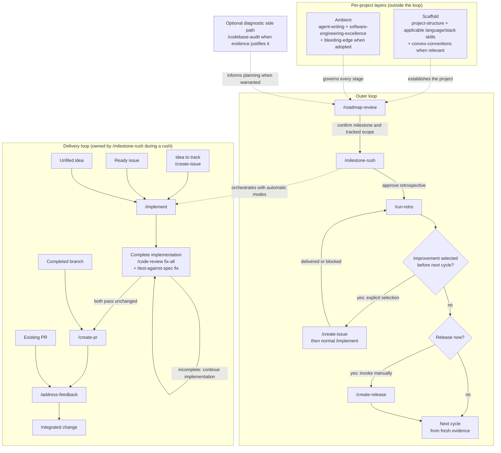

# Known Good Route


My personal collection of portable agent skills for carrying an agreed task to
a verified result across projects, with less steering, avoidable waiting and
rework. The core is the implementation, review and PR delivery loop; planning,
setup and stack guidance support it when relevant.

Skills encode workflow decisions, completion criteria and authorization.
Repositories own product requirements and project commands; tested helpers and
the host harness own execution mechanics. We validate changes against bounded
cases drawn from real work; see [the acceptance strategy](evals/ACCEPTANCE.md).

## Install

```bash
npx skills add frostney/known-good-route
```

Installs into your skills-compatible agent(s): Cursor, Claude Code, Codex, GitHub Copilot, and more. See [skills.sh](https://www.skills.sh/) for details.

## Usage

These are [Agent Skills](https://agentskills.io): any skills-compatible agent loads each skill's `name` and `description` at startup and reads the full `SKILL.md` when a task matches. Several are invoked directly as slash commands (e.g. `/create-pr`, `/implement`); the rest activate from ambient context. The skills split into recurring workflow skills and one-off setup, guidance, and audit skills.

### Operating loop

Establish each repository's **Scaffold** once, keep its **Ambient** guidance
active throughout, and run the outer loop from fresh project, issue, and
pull-request evidence.
Enter at the state the work is actually in; never replay earlier stages merely
for ceremony.



- **Scaffold** is the repository's structural and stack foundation:
  `project-structure`, the applicable language and stack skills, and
  `convex-conventions` when Convex is in scope. It is not another step in every
  delivery cycle.
- **Ambient** guidance governs every stage: `agent-writing`,
  `software-engineering-excellence`, plus `bleeding-edge` when the project has
  adopted it. Software engineering excellence keeps the parent objective active
  across corrections, questions, partial results, and worker returns. For
  substantial deliverables, use bounded workers when the task and host support
  delegation; keep small ordinary work local. The coordinator retains decisions,
  verifies returned evidence and completes the parent outcome.
- Every outer-loop transition is human-controlled. `/roadmap-review` proposes
  the milestone, `/milestone-rush` offers the retrospective after integrated
  completion, and `/create-release` is an optional manual step after
  `/run-retro`; none starts the next stage automatically.
- `/run-retro` may recommend an improvement before the next cycle, but only an
  explicit user selection enters `/create-issue` and normal
  `/implement`. The retrospective remains active until that selected
  action is delivered or genuinely blocked.
- While `/milestone-rush` is active, let it own the nested delivery loop. It
  delegates implementation through the automatic modes, PR handoff, continuous
  review-axis-lane code review, and merge instead of asking the user to invoke
  those child commands.
- For ad-hoc or already-started work, enter the delivery loop at the matching
  state: record an idea with `/create-issue`, implement a ready issue or unfiled
  idea, hand off a completed branch with `/create-pr`, or continue an existing
  PR or native stack with `/address-feedback`. Both consolidated skills resolve
  and check the target from context; numbers, URLs, and descriptions are optional
  aids, and no mode selector is required.
- `/codebase-audit` is a diagnostic side path when repository evidence warrants
  a whole-codebase assessment, not a mandatory checkpoint.
- Supporting mechanics stay underneath the loop: `git-workflow` governs git
  operations, `/code-review fix-all` is the ordinary bounded pre-PR review,
  `/test-against-spec fix` performs black-box behavior testing after review,
  milestone rush uses `/code-review subagents fix-all`, and `/update-pr` handles
  reviewed and behaviorally tested commits and pushes.

### Recurring workflow skills

| Skill | What it does |
| --- | --- |
| [`git-workflow`](git-workflow/SKILL.md) | Applies the user's git defaults: branch from the remote default, merge rather than rebase for ordinary branches, use native GitHub stacks when selected, never amend, and squash-merge pull requests. Use when branching, syncing, committing, pushing, or merging in the user's repos. |
| [`status-report`](status-report/SKILL.md) | Builds a read-only current-repository Kanban from live pull-request, CI, review, branch, and worktree evidence. Use when the user asks for a status report, PR board, review-readiness board, or local-work overview. |
| [`create-issue`](create-issue/SKILL.md) | Investigates and creates a project-aligned GitHub issue from a tagline or short description, using the repository's template, evidence, and labels. Use when the user runs /create-issue or asks to file a GitHub issue. |
| [`implement`](implement/SKILL.md) | Implements a GitHub issue or unfiled idea through investigation, approach selection, validation, and PR handoff. Use when asked to implement an issue or build a feature, or when the user runs /implement. |
| [`run-retro`](run-retro/SKILL.md) | Review a workstream and agree process improvements when the user requests or accepts a retrospective. Apply only selected follow-up actions. |
| [`create-pr`](create-pr/SKILL.md) | Publishes a completed change as a templated draft pull request, reconciles PR-only metadata and readiness state, waits for CI, and marks it ready. Use when the user runs /create-pr. |
| [`update-pr`](update-pr/SKILL.md) | Commits relevant changes, merges the remote default when needed, pushes the current pull-request branch, and refreshes stale PR metadata. Use when the user runs /update-pr or asks to update a pull request. |
| [`address-feedback`](address-feedback/SKILL.md) | Resolves review feedback on one pull request or native GitHub stack. Use when asked to address PR or stack feedback, or when the user runs /address-feedback. |
| [`delivery-wait`](delivery-wait/SKILL.md) | Provides deterministic, resumable GitHub transition waits used internally by delivery workflows. Use when another workflow must await CI, merge, tag, or release state without model heartbeats. |
| [`code-review`](code-review/SKILL.md) | Review a PR, branch, or worktree for evidence-backed findings. Supports scoped revalidation and explicitly requested fixes or review workers. |
| [`test-against-spec`](test-against-spec/SKILL.md) | Tests delivered behavior against explicit requirements through real product interfaces, preferring an exact-revision preview deployment when available. Use when the user runs /test-against-spec or a workflow needs black-box evidence; add the exact `fix` qualifier to authorize in-scope fixes. |
| [`create-release`](create-release/SKILL.md) | Prepares a changelog-first release and, only when explicitly requested, publishes it through the repository's single established release path. Use when the user asks to prepare, cut, tag, or publish a release, bump the version, or generate release notes. |
| [`roadmap-review`](roadmap-review/SKILL.md) | Reviews a roadmap from fresh project evidence and produces a verified, throughput-anchored version plan, with execution gated on confirmation. Use when reviewing a roadmap, planning releases, or sequencing a backlog. |
| [`milestone-rush`](milestone-rush/SKILL.md) | Autonomously completes a confirmed milestone by reconciling existing work, parallelizing independent implementation, converging and merging pull requests, and closing the verified milestone. Use when the user runs /milestone-rush for an exact milestone or selects it after /roadmap-review. |

### One-off project setup, guidance, and audit skills

| Skill | What it does |
| --- | --- |
| [`project-structure`](project-structure/SKILL.md) | Applies the user's language-agnostic repository layout, documentation, governance, hook, test, agent-file, and changelog conventions. Use when scaffolding or restructuring a repo, writing AGENTS.md or docs, or laying out folders. |
| [`maintain-project-skills`](maintain-project-skills/SKILL.md) | Install, update, or migrate project-local skills from their verified upstream source while preserving local ownership and pins. |
| [`typescript-stack`](typescript-stack/SKILL.md) | Applies strict, runtime-aligned TypeScript conventions for compiler setup, types, modules, APIs, tests, and validation without imposing a frontend framework. Use when scaffolding, configuring, writing, reviewing, or upgrading TypeScript in web, service, CLI, library, or tooling projects. |
| [`react-stack`](react-stack/SKILL.md) | Applies the user's Bun-based React stack across Next.js web and Expo universal profiles, deferring backend and repository details to their domain skills. Use when scaffolding a React app, upgrading dependencies, choosing MVP tooling, or selecting a project profile. |
| [`native-nostalgia-stack`](native-nostalgia-stack/SKILL.md) | Applies the user's FreePascal toolchain and its build, formatting, hook, and test contracts while leaving project-specific mechanics local. Use when scaffolding or working in a FreePascal project that follows this toolchain. |
| [`convex-conventions`](convex-conventions/SKILL.md) | Applies the user's Convex backend conventions while deferring mechanics to upstream Convex skills and current APIs to the live Convex docs. Use when scaffolding, reviewing, or refactoring Convex functions, schemas, or auth. |
| [`codebase-audit`](codebase-audit/SKILL.md) | Audit a repository or subsystem for systemic engineering risks and actionable improvements. Assessment only unless follow-up fixes are selected. |
| [`agent-behavior-audit`](agent-behavior-audit/SKILL.md) | Audit agent execution records for instruction compliance, outcome quality, and wasted work using source-backed evidence. |
| [`software-engineering-excellence`](software-engineering-excellence/SKILL.md) | Apply the user's engineering standards during substantial technical work: preserve scope, use current evidence, and complete authorized outcomes. |
| [`agent-writing`](agent-writing/SKILL.md) | Write clear, concise agent replies and engineering artifacts while preserving evidence, decisions, and required detail. |
| [`bleeding-edge`](bleeding-edge/SKILL.md) | Biases technology choices toward the newest viable option while preserving maintainability, live verification, reversibility, and decided constraints. Use when selecting or upgrading a dependency, runtime, tool, language feature, or AI model. |

### PR descriptions and walkthroughs

`create-pr` and `update-pr` describe the complete final change against its base,
following the [PR writing guidance](agent-writing/references/pr-descriptions.md).
Keep ordinary descriptions concise, preserve explicit project templates and
omit routine testing prose unless required. Material limitations stay visible;
use diagrams, code examples and longer rationale when they help review.
Show visible before/after media and benchmark tables, identifying the target
branch baseline and PR candidate for performance comparisons.

When meaningful UI, CLI or backend behavior benefits from a demonstration,
prepare a short video with voice-over and synchronized subtitles using the
[walkthrough procedure](create-pr/references/walkthroughs.md). Documentation and
skills need one only when an actual workflow example helps. Discover capture,
speech, assembly, captions, playback and upload capabilities on the current OS;
reuse current media and verify the exported and uploaded result. Missing media
tools or baseline captures are reported with exact gaps and practical remedies.
Media tooling gaps alone do not block publication or readiness; required review,
behavior evidence and CI still apply. Media stays out of source control.

## Background

Design decisions and conventions shared across every skill in this collection.

The suite is also audited against
[Writing Great Skills](https://github.com/mattpocock/skills/tree/main/skills/productivity/writing-great-skills):
keep the process predictable, make completion requirements easy to check, keep
each rule in one authoritative place, put branch-specific detail behind direct
context pointers, and prune no-op prose.

### Frontier-model prompt contract

The skills target current frontier models without relying on one model's default
behavior. The current baseline is the official guidance for
[GPT-6 Astra](https://developers.openai.com/api/docs/guides/latest-model#prompting-best-practices),
[Claude Fable 5.1](https://platform.claude.com/docs/en/build-with-claude/prompt-engineering/prompting-claude-fable-5-1),
and
[Claude Opus 5](https://platform.claude.com/docs/en/build-with-claude/prompt-engineering/prompting-claude-opus-5),
checked on September 7, 2026.

- Lead with the owned outcome, why it matters, completion evidence, boundaries,
  and stop rules. Prescribe exact mechanics only when the route is load-bearing.
- State each runtime rule once. Use `must`, `never`, and `only` for genuine
  invariants; use decision rules for investigation depth, optional tools,
  proportional validation, and when user input is truly required.
- Preserve task-specific checks that define completion. Do not add generic
  self-check, double-check, or verifier passes around them.
- Delegate only genuinely independent, sizeable work with a bounded fan-out.
  Do not use subagents merely to duplicate work or re-check a small task.
- For autonomous orchestration, repository-owned capability classes, context
  envelopes, token checkpoints, and escalation policy belong in
  `ORCHESTRATION.md`. Provider-specific model selection and harness plumbing stay
  in the host; reusable skills express only capability and observable behavior.
- Ground progress and completion claims in current tool or source evidence.
  Report sparse outcomes at material phase changes; finish authorized reversible
  work instead of ending on a promise or a redundant permission question.
- Lead final responses and written artifacts with the outcome. Keep complete,
  readable sentences and decision-relevant evidence; omit filler, boilerplate,
  repeated summaries, and internal-reasoning narration.
- Keep startup descriptions limited to the outcome and when to use the skill. Put
  model effort, verbosity, thinking, context-budget plumbing, asynchronous
  progress delivery, and any model-specific verifier strategy in the harness.
- Keep ambient repository context lightweight and specific: non-obvious
  decisions, gotchas, commands, and boundaries rather than facts visible in the
  tree. Prefer expressive tool and file interfaces plus rich references over
  generic worked examples that narrow exploration.
- Validate prompt changes incrementally on the same representative scenarios.

Astra's guidance emphasizes clear instruction precedence, authorized
follow-through and proportionate testing. Fable 5.1's guidance calls out task
completion, useful progress updates, scoped edits and preserved decisions;
Opus 5 warns that generic verification or verifier-subagent instructions can
cause excess checking. These sources inform the shared rules above. The harness
owns provider-specific controls and evaluates them on the intended workload.

### Conventions across all skills

- Each skill has a concise `SKILL.md` with conforming frontmatter (`name`,
  `description` stating the outcome and when it applies, `license`, and
  `compatibility` only for real environment requirements). Situational detail
  belongs in directly linked, one-level `references/`; the entry skill says
  exactly when to read each file. No `disable-model-invocation`.
- **Workflow skills** state the outcome, true gates, authorization boundaries,
  and stop rules before exact mechanics. Preserve procedural detail only where
  sequencing is load-bearing.
- **Convention skills** keep durable decisions and audit-checkable completion
  evidence in the entry skill; templates, profiles, and implementation contracts
  load only when relevant.
- **Verify versions live** is a recurring rule across stack skills: the agent confirms the current stable version of every dependency from the registry (`bun pm view <package> version`) or official release notes before adding or upgrading any dependency. Memory and prior conversation turns are not acceptable sources.
- **Live docs override the skill on conflict** for any third-party surface that evolves quickly (Convex, AI Gateway, etc.).
- **No project names** appear in any skill body: patterns are extracted, named projects aren't.
- **Examples** are exceptional. Prefer expressive interfaces and high-fidelity
  references such as code, tests, specs, and artifacts; use a prose example only
  when it resolves an otherwise ambiguous decision.
- **Standalone fallbacks stay concise.** A workflow invokes another installed
  skill when that skill owns the task. When the companion skill is unavailable,
  preserve the required outcome directly without depending on its internal
  files or copying its full procedure.

### Cross-skill references

- `implement` invokes `/create-pr` at handoff.
- `implement` applies `git-workflow`'s clean-worktree
  and freshly fetched remote-default synchronization gate after selecting a
  branch/worktree and before editing.
- `implement` repeats `/code-review fix-all` followed
  by `/test-against-spec fix` until both pass on the same unchanged
  implementation. It uses a concise black-box fallback when the testing skill
  is unavailable, runs the project gate after the loop, then invokes `/create-pr`.
- After selection or automatic entry, `implement`
  remains active across status questions, diagnoses, corrections, and failed
  gates. It returns control only when complete, externally blocked after safe
  alternatives, or awaiting new authority or a material unresolved decision.
- `code-review` and `codebase-audit` delegate only when the caller supplies the
  additive `subagents` input. Workers own bounded evidence lanes; the
  coordinator owns findings, verdicts, edits, and reported fallbacks.
- `address-feedback` in PR scope repeats `/code-review fix-all` followed by
  `/test-against-spec fix` or its black-box fallback before each substantive
  code push. It runs the project gate only after both pass unchanged, then
  invokes `/update-pr`. It owns review inspection, deterministic waiting,
  replies, and thread resolution through its bundled helper. Read-only mode
  remains non-mutating.
- `address-feedback` in stack scope owns one repository-scoped native stack
  identity. It reviews initial exact-head layers once, freezes them, puts all validated live
  fixes in one new top layer per round, reviews only that new layer, and returns
  `ready` only for the complete unchanged stack. Lower layers covered by a top
  fix layer cannot be merged as a prefix. Read-only mode disables every
  mutation, and the skill never merges or purchases review capacity.
- `test-against-spec` proves externally observable behavior without using source
  as evidence. It prefers an exact-revision preview deployment when available,
  falls back to the local environment, reports by default, and fixes only with
  the exact `fix` qualifier. It never owns the broad project gate.
- `create-pr` publishes a completed branch. It verifies that completion evidence
  and the project gate apply to the exact change, reuses current gate evidence,
  corrects PR-only metadata and waits for CI. It may record an already-validated
  scenario for a walkthrough, but missing behavior testing or implementation
  fixes return to the implementation workflow.
- `create-pr` and `update-pr` use `agent-writing`'s PR description contract.
  `update-pr` refreshes affected walkthrough segments and removes stale summaries
  or intermediate development history.
- `address-feedback automatic-merge` in PR scope discovers active review automation,
  treats incomplete verdicts as pending, and owns one ordinary PR's exact-head
  fix-watch-squash-merge loop. Stack scheduling and atomic merge stay outside
  it.
- `status-report` reuses the current-head CI and reviewer-readiness semantics of
  `address-feedback` in PR scope and `milestone-rush`, but remains strictly
  read-only and never invokes either workflow.
- `create-release` invokes `/create-pr` to open the release PR, follows
  `git-workflow` for branching and push rules, and defers to `project-structure`
  for changelog tooling. Its publication gate re-reads merged workflows and
  chooses exactly one tag/release publisher before acting.
- `roadmap-review` defers to `software-engineering-excellence` for the general engineering bar, to `project-structure` for `VISION.md` / docs and milestone conventions, recommends (but never performs) release cuts via `/create-release`, and delegates issue creation in the Execute phase to `/create-issue`.
- `roadmap-review` offers `/milestone-rush` only after the user confirms the
  milestone and tracked scope; it never starts the execution engine
  automatically.
- `milestone-rush` parallelizes independent nodes through `/implement automatic`,
  passing the issue or confirmed roadmap item in each worker packet. It uses
  `/address-feedback automatic-merge` with the ordinary PR in context, or
  `/address-feedback` once with the complete native stack in context before the
  coordinator atomically merges the complete ready stack. Each implementation's bounded
  pre-PR pass uses `/code-review subagents fix-all` by default, while ordinary
  standalone implementations remain unchanged. It never creates a release and
  invokes `/run-retro` only after explicit approval.
- `run-retro` consumes Milestone Rush's ignored JSONL event ledger when present,
  validates and summarizes normalized delta or snapshot measurements,
  reconciles them with issue, pull-request, and repository evidence, and keeps
  exclusive elapsed bottlenecks separate from overlapping and aggregate
  resource consumption. Host integrations own provider-specific adapters. It
  presents outcomes and proposed improvements in conversation and uses
  `grilling` to select actions.
- `create-issue` invokes `/grill-with-docs` or `/grill-me` for thoroughness when
  registered. `implement` reuses a settled approach; unresolved non-automatic
  comparisons use the registered `grilling` skill.
- When an approach comparison is needed, `implement` derives viable options
  from shared evidence and uses equivalent decision-relevant checks before
  recommending. Current external evidence is required only for decisions that
  depend on it; unavailable evidence stops that dependent work.
- `create-issue` and `implement` read `VISION.md` when present and stop for
  clarification when the request conflicts with it.
- `create-issue` and `implement` support an explicit `automatic` mode where the
  agent selects the project-context recommendation after completing the
  required investigation and gates. Implementation automatic mode skips
  `grilling`.
- `run-retro` requires `grilling` for the retrospective interview and final
  confirmation, then applies only user-selected documentation edits and ticket
  actions. It traces originating decisions, executable behavior, documentation,
  and complete available coordinator/subagent evidence before recommending a
  correction. An explicitly selected implement-before-next-cycle action passes
  through `/create-issue` and normal `/implement` while the retrospective
  remains active.
- `typescript-stack`, `react-stack`, and `native-nostalgia-stack` defer to
  `project-structure` for language-neutral repository policy. `react-stack`
  delegates TypeScript language policy to `typescript-stack` and Convex
  specifics to `convex-conventions`.
- `agent-writing` applies to agent-authored communication and engineering
  artifacts, but not application-generated or branded product output.
  Project-specific instructions and templates take precedence. Issues may
  contain many concise items; review replies preserve complete dispositions,
  evidence, and attribution without a fixed character cap.
- `software-engineering-excellence` preserves the parent objective and settled
  decisions across added context, corrections, questions, checkpoints, and
  bounded worker results. It pauses only the exact gated transition and treats
  completion as a verified parent state rather than the last message's local
  result.
- `bleeding-edge` sits beneath `software-engineering-excellence` as a subordinate lens: it tilts the default technology choice toward the newest viable option while SEE remains the governor and maintainability stays the tiebreaker. It reuses the cross-skill "verify versions live" rule, and it applies its bias *within* the choices decided by the stack skills and `AGENTS.md` Hard Constraints rather than silently swapping them.

## Contributing

Edit or add a `SKILL.md`, then validate it locally before opening a PR:

```bash
pip install --upgrade skills-ref
agentskills validate ./<skill>
```

Every skill is validated against the [Agent Skills specification](https://agentskills.io/specification) in CI via [`skills-ref`](https://github.com/agentskills/agentskills): see [`.github/workflows/validate-skills.yml`](.github/workflows/validate-skills.yml).

For behavioral changes, follow the bounded [acceptance strategy](evals/ACCEPTANCE.md)
and select relevant scenarios and models. The table describes expected behavior,
not a required full-matrix run or a claim that every scenario currently passes:

| Scenario | Expected invariant |
| --- | --- |
| Clear implementation with one selected option | Completes without another permission prompt or unrelated cleanup |
| Materially ambiguous architecture | Surfaces the decision and recommendation before editing |
| Already-fixed issue | Reports source/test evidence instead of inventing a change |
| Branch with committed work and a clean tree | Reuses current completion evidence, then opens the PR without creating an empty commit |
| Dirty focused branch with unrelated local state | Commits only the completed relevant work, excludes secrets, and marks the PR ready only after publication requirements and CI pass |
| Implementation misses required behavior | Runs code review, reproduces and fixes the gap through the delivered interface, then repeats review and black-box testing until both pass unchanged |
| Draft PR missing a Definition of Ready item | Reports missing implementation evidence without publishing, or corrects PR-only metadata and then waits for green CI before marking ready |
| Draft PR missing only required metadata | Corrects the PR body or links without creating an empty commit |
| Definition of Ready requires a material decision | Keeps the PR draft and reports the exact unresolved decision |
| Code, behavior, pending, or external CI failure | Keeps the PR draft and returns code or behavior failures to implementation; pending or external failures remain pending |
| PR update with additive merge conflicts | Preserves both feature paths, validates the merge, and pushes normally |
| Explicitly read-only PR review | Reports validated findings without editing or changing PR state |
| Mixed actionable and invalid inline findings | Fixes validated findings, rebuts invalid ones inline, and never posts a top-level comment |
| Review fixes ready to push | Repeats `/code-review fix-all` and black-box testing until both pass unchanged, then passes the project gate before committing and pushing |
| Read-only behavior check with a current preview | Prefers the exact-revision preview, exercises every observable requirement, and reports results without reading source or editing |
| Behavior fix lacks a reproducible environment | Fixes and retests as far as available access permits, then reports the remaining behavior as unverified without claiming completion |
| Required behavior needs a preview that does not exist | Opens a draft only when the user explicitly requests it to obtain the preview, keeps it draft, and returns to behavior testing on the exact deployed revision |
| Issue draft awaiting approval | Investigates, grills, and presents the project-aligned draft without filing it |
| Automatic issue creation and exact duplicate | Completes every investigation/grill gate before filing, but stops immediately for the existing issue |
| Artifact-assisted implementation grill | Derives all viable options from one evidence packet and compares them with a predeclared rubric plus equivalent decision-relevant checks before selection |
| Existing-contract implementation grill | Inspects the embedded behavioral contract and runs an executable compatibility probe before architecture or option selection |
| Required current web research unavailable | Stops before presenting implementation options or editing |
| Default code review and repository-wide audit | Reproduces safe boundary behavior and reports evidence without remediating in read-only mode |
| File-scoped code review | Reports findings only in the exact requested files while disclosing any supporting context needed to validate them |
| Prior-findings revalidation | Rechecks selected review or audit findings against current committed and dirty state without silently performing a fresh review |
| Churn-backed review with JSON output | Measures symbol/file history, requires a concrete architectural co-signal, and writes only the requested machine-readable findings artifact |
| Audit probe requires production mutation | Marks the path static-only and unreached instead of creating an external side effect |
| Measured prototype misses its required target | Stops before production migration, publication, or speculative follow-on work |
| Slow command, hook, local environment, or CI path | Measures the critical feedback path and improves it under the maintainability governor instead of postponing speed until handoff |
| Stale audit with missing evidence | Separates confirmed gaps, corrected claims, and unsupported measurements before planning |
| Rate-limited review bot | Reports the review as unavailable or incomplete, never passed |
| Automatic merge with active review tooling | Retriggers incomplete reviews, evaluates inline and summary findings, and merges only the fully reviewed current head |
| Automatic idea with a provisional mini-spec | Researches, adds the appropriate artifact, confirms the final mini-spec, implements, validates, reviews, and completes the PR handoff |
| Tag-triggered release workflow | Pushes the tag once, monitors automation, and never calls `gh release create` |
| No releasable commits or ambiguous publisher | Stops without manufacturing a version change, tag, or release |
| New branch, Git sync, dirty worktree, and divergent push | Starts focused work at the fetched remote-default tip without tracking it, merges updates without rebasing, stops before syncing dirty work, and never forces a rejected push |
| Sparse or mutation-ready roadmap review | Lowers confidence when evidence is thin and asks before document, issue, or pull-request changes |
| Parallel milestone rush with mixed existing state | Reuses delivered, PR, branch, worktree, and issue state; rolls independent merges forward; and closes only after integrated validation |
| Explicit sub-agent review or audit | Maps bounded evidence lanes, keeps verdicts and edits with the coordinator, and reports any single-agent fallback |
| Milestone rush with a blocked dependency chain | Completes independent work, records replacement and deferred scope, and leaves the blocked milestone open |
| Project structure and stack conventions | Repairs real drift while preserving valid ecosystem layouts and recorded toolchain pins |
| React profile mismatch | Uses the applicable web profile, but does not force web or universal defaults onto an Electron-only project |
| Convex function boundaries | Enforces public validation/auth/rate limits and keeps external I/O in actions with persistence in internal mutations |
| Stable dependency and competing tool choice | Selects the live-verified newest stable version but preserves an authoritative recorded tool decision |
| Retrospective with no durable lesson | Completes all three lenses and reports no action instead of inventing documentation or tickets |
| Long autonomous run | Grounds every progress/completion claim in current evidence and does not end on a promise |
| Chained substantial deliverables | Keeps decisions and provenance with the coordinator, uses bounded workers where appropriate and supported, and verifies each result before completing the parent task |
| Small local change | Runs the real project gate without generic re-checks or verifier subagents |
| Local convention differs from a generic default | Follows the surrounding code and project gate instead of imposing a blanket style rule |
| Pascal identifier contains a standard initialism | Preserves forms such as `HTTP` and `GC` unless an external API or project rule requires another spelling |
| Written issue, PR, roadmap, or retrospective | Leads with the outcome and omits filler, boilerplate, and repeated summaries |
| PR description and useful behavior walkthrough | Describes the final change, preserves explicit templates, shows comparable evidence, and reports incomplete narration, subtitles or media tooling without inventing assets or adding a media-only readiness blocker |
| Agent-authored response or engineering artifact | Uses project terminology, evidence sources, templates, and exact required text without importing product voice; leads with current evidence and preserves quoted source and code exactly |

The [behavioral eval harness](evals/README.md) runs isolated fixture scenarios
through the native Codex and Claude CLIs using their saved local logins.
`bun run check` validates without model calls; `bun run eval` explicitly runs
the selected local model matrix. CI and GitHub labels never start live evals.

**Validator freshness policy:** `skills-ref` is intentionally installed unpinned (`pip install --upgrade skills-ref`) so CI always validates against the latest published spec implementation rather than a frozen snapshot. The workflow caches `~/.cache/pip` to speed up installs; this is safe because pip still resolves the newest release from the index on every run and only reuses a cached wheel when that exact version was already downloaded, so caching never holds back the validator version. This "always latest" rule applies only to the validator package itself: the workflow's GitHub Actions (`checkout`, `setup-python`, `cache`) are pinned to full commit SHAs (with the version in a trailing comment) for supply-chain safety, which is the recommended hardening practice for third-party actions.

## License

Dual-licensed under either of [The Unlicense](LICENSE) (public domain) or the [MIT License](LICENSE-MIT) at your option. The SPDX expression is `Unlicense OR MIT`; each skill declares it in frontmatter.
